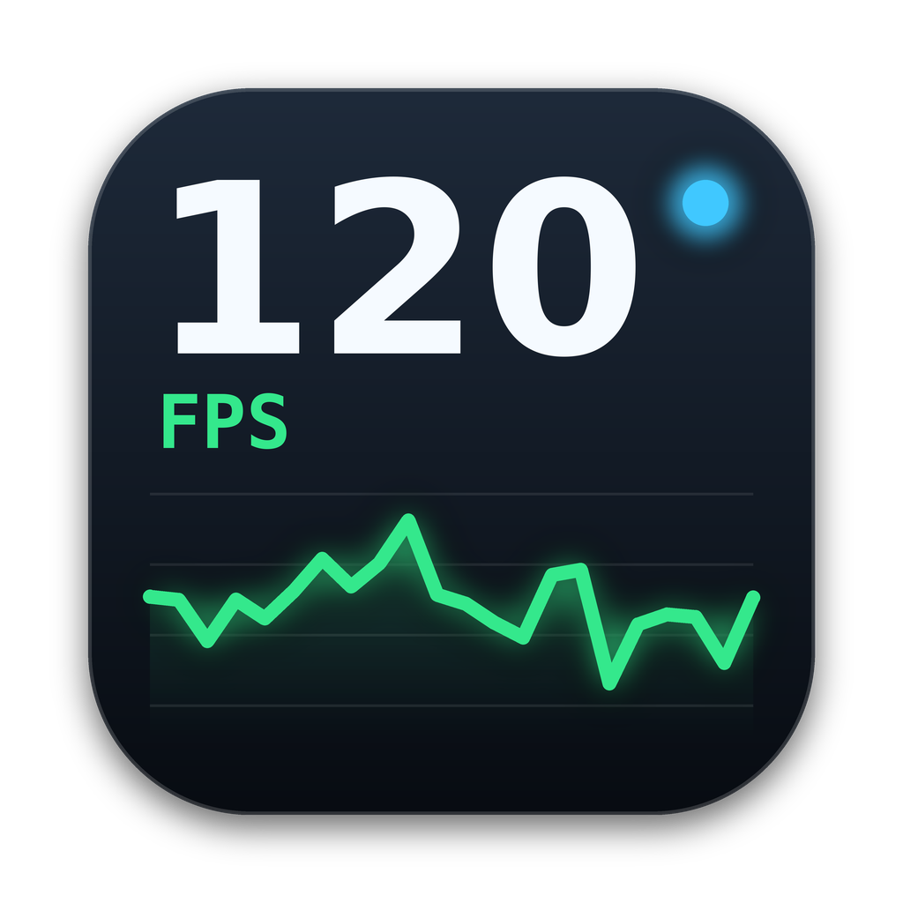

# Metal HUD Toggle

A tiny macOS menu bar app to turn Apple's **Metal Performance HUD** on and off and choose exactly what it shows — no Terminal needed.

<p align="center"></p>

## Features

- One switch to enable/disable the Metal HUD for apps you open afterwards
- Pick individual metrics (FPS, frame interval, GPU time, memory, MetalFX, shader compilation, …)
- Custom position (3×3 grid), scale and opacity
- Optional logging of frame stats and shader compilation (visible in Console, filter by `metal-HUD`)
- Start at login, or start at login with the HUD already on
- Lives in the menu bar only — no Dock icon

## How it works

The app sets the `MTL_HUD_*` environment variables in the user's launchd session with `launchctl setenv`
(`MTL_HUD_ENABLED`, `MTL_HUD_ELEMENTS`, `MTL_HUD_ALIGNMENT`, `MTL_HUD_SCALE`, `MTL_HUD_OPACITY`, and the logging variables).
Metal apps read them at launch, so:

- Changes only affect apps opened **after** the change — restart running apps to see them.
- The variables don't survive a reboot; use *Start at login with HUD on* to re-apply them automatically.

## Requirements

- macOS 13 Ventura or later
- Xcode or the Command Line Tools (`xcode-select --install`) to build

## Build & install

```bash
git clone https://github.com/<your-user>/MetalHUDToggle.git
cd MetalHUDToggle
bash build_app.sh
cp -R MetalHUDToggle.app /Applications/
open /Applications/MetalHUDToggle.app
```

The app is signed ad-hoc. If macOS blocks it, right-click → Open, or run:

```bash
xattr -dr com.apple.quarantine /Applications/MetalHUDToggle.app
```

## Project layout

```
Sources/MetalHUDToggle/
  MetalHUDToggleApp.swift   # menu bar UI (SwiftUI MenuBarExtra)
  HUDModel.swift            # state, launchctl, login item
  HUDOptions.swift          # HUD elements / positions
Icon/AppIcon.png            # 1024px source icon (converted to .icns by build_app.sh)
build_app.sh                # builds and packages the .app
```

## Notes

The app is not sandboxed because it needs to call `launchctl`.
